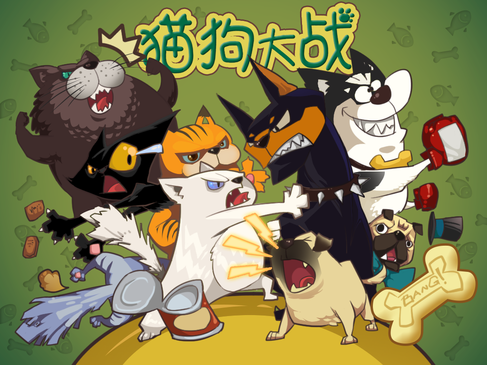

# Starter Kit 猫狗大战 卡牌客户端

##更多源码

[泰然源码](http://bbs.ityran.com/forum-61-1.html "iTyran")

##加入我们

[泰然教程组](http://www.ityran.com/about/#1 "Team iTyran")

##宣传画


##视频地址

[优酷视频](http://v.youku.com/v_show/id_XNjE1NDI3NzI4.html "youku")


##Cocos2d-x版本

基于：Cocos2d-x 2.1.5 

语言：JS（JSB）

作者：u0u0（刘克男）,一叶（刘雪锋），Iven（杨雍）

##目录结构

客户端工程目录

	projects/CardGame
	
	
##测试包下载

客户端测试包下载（ipa+apk）：

	微信收听" 泰然网 "微信公众账号，回复“猫狗大战”即可获取下载地址。
	
泰然公众账号二维码：


##服务器下载

###属性

语言：Golang

网络：websocket

作者：u0u0（刘克男）

###下载地址：

[Server下载](http://bbs.ityran.com/thread-10041-1-1.html "Server Download")

###接口示例

#### Login module

Register

```
{
    "Command" : "CM_REGISTER",
        "Param":
        {
            "Username" : "xxx",
            "Password" : "aa",
            "Email" : "a@x.com"
        }
}

{
    "Command" : "CM_REGISTER",
        "Return" :
        {
            "Code" : 0,
            "Message" : "CreateCharacter"
        }
}
```

Login

```
{
    "Command" : "CM_LOGIN",
        "Param" :
        {
            "Username" : "xxx",
            "Password" : "aa"
        }
}

{
    "Command" : "CM_LOGIN",
        "Return" :
        {
            "Code" : 0,
            "Message" : "Success" // or "CreateCharacter"
        }
}

```

Create character (LOGIN FIRST)

```
{
    "Command" : "CM_CHAR_CREATE",
        "Param" :
        {
            "CharName" : "xxx",
        }
}

{
    "Command" : "CM_CHAR_CREATE",
        "Return" :
        {
            "Code" : 0,
            "Message" : {json of char info}
        }
}

```

Get character (LOGIN FIRST)

```
{
    "Command" : "CM_CHAR_GET",
        "Param" : ""
}

{
    "Command" : "CM_CHAR_GET",
        "Return" :
        {
            "Code" : 0,
            "Message" : {json of char info}
        }
}
```

json of char info
```
{
    "CharName": "a New Name ",
    "Level" : 1,
    "Vitality": 60,
    "Scene": 1,
    "Stage" : 1
}
```

Get card array

```
{
    "Command" : "CM_CARDS_GET",
        "Param" : ""
}

{
    "Command" : "CM_CARDS_GET",
        "Return" :
        {
            "Code" : 0,
            "Message" : {json of card array}
        }
}
```

json of card array

```
[
{
    "Name": "小花猫",
    "HP": 21,
    "Attack": 27,
    "Defence": 13,
    "Speed": 120,
    "Talent": 720,
    "Drop": 50,
    "Experience": 324,
    "Skill": [1,2],
    "ID": "002",
    "Level": 1,
    "Status": 1,
    "Hash": "0xc2000e9630",
}
]
```

Raid

```
{
    "Command" : "CM_RAID",
        "Param" : {
            "Scene" : 1,
            "Stage" : 1
        }
}

{
    "Command" : "CM_RAID",
        "Return" : 
        {
            "Code" : 0,
            "Message" : "{battle command order}"
        }
}
```


